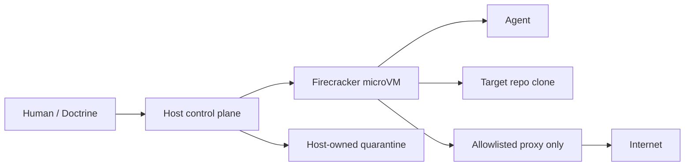
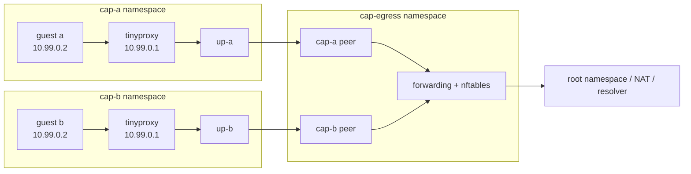
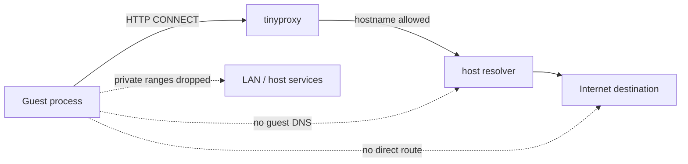
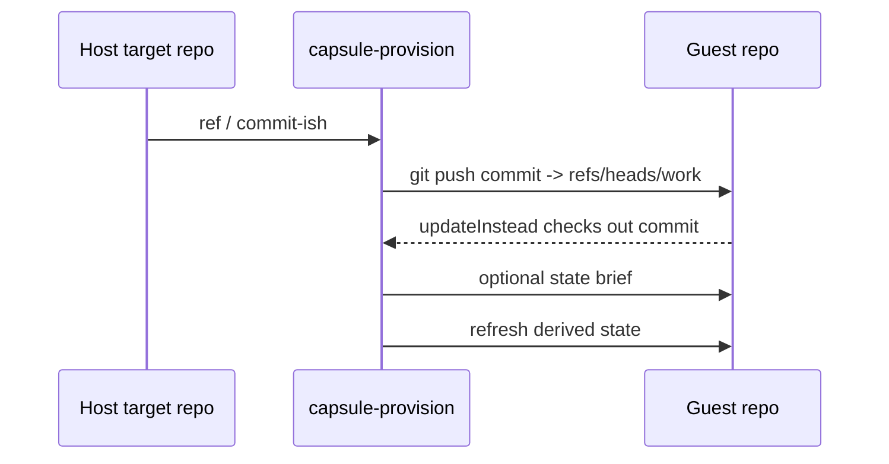
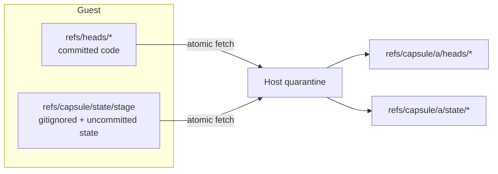
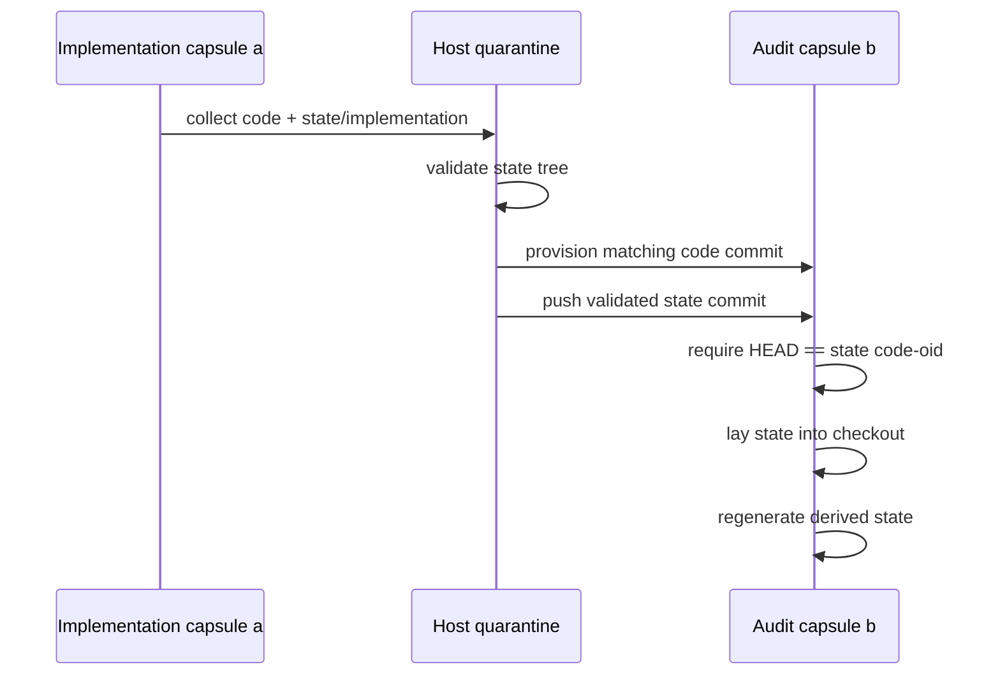
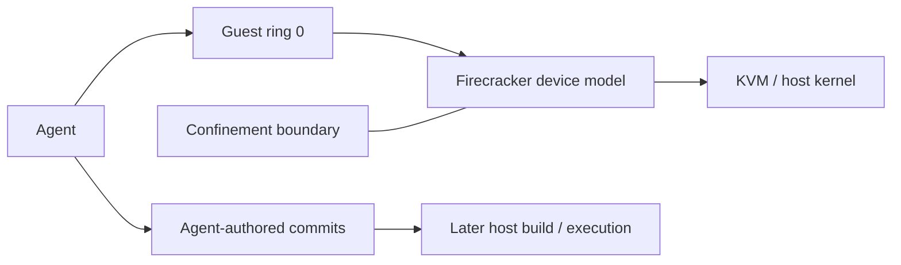

# Oubliette architecture walkthrough

Oubliette is a **host-controlled Firecracker microVM jail for coding agents**. The useful way to understand it is not as one large architecture diagram, but as a sequence of small boundaries and flows.

This walkthrough describes the current `davidlee/oubliette` shape, including multi-capsule network namespaces and the code/state sideband used to hand work from an implementation capsule to an audit capsule.

---

## 1. The basic shape

**Question:** what is Oubliette actually putting between the agent and the host?



The agent works in a real clone, but the clone lives inside a microVM. The host owns provisioning, collection, network policy, and the quarantine into which guest-authored results are fetched.

The important asymmetry is: **the guest works; the host decides what crosses the boundary.**

Source: [`vm/capsule.nix`](../vm/capsule.nix), [`host/services.nix`](../host/services.nix), [`host/git-channel.nix`](../host/git-channel.nix).

---

## 2. A capsule is a slot, not a bespoke VM

**Question:** what changes when there are several capsules?

```mermaid
flowchart TB
    IMG[One guest image / closure]

    IMG --> A[slot a]
    IMG --> B[slot b]

    A --> NA[network namespace cap-a]
    B --> NB[network namespace cap-b]

    A --> VA[persistent volume a]
    B --> VB[persistent volume b]

    A --> SA[/run/capsule/a/ssh.sock]
    B --> SB[/run/capsule/b/ssh.sock]
```

Slots are deliberately abstract names. They do not mean “Doctrine”, “implementation”, or “spare”. Each slot gets its own namespace, volume, socket, and host state, while every slot can run the same guest image.

That is why the guest can use the same internal addresses and hostname in every capsule.

Source: [`capsules.nix`](../capsules.nix), [`host/services.nix`](../host/services.nix).

---

## 3. Inside the guest

**Question:** what does the agent actually see?

```mermaid
flowchart TB
    subgraph G[Firecracker guest]
        AG[agent user]
        REPO[/work/doctrine]
        CACHE[/work caches + HOME]
        GIT[git]
        SSH[sshd]
        PX[HTTP(S)_PROXY]

        AG --> REPO
        AG --> GIT
        AG --> CACHE
        AG --> PX
        SSH --> AG
    end

    PX --> HOSTPROXY[host proxy]
```

`/work` is the persistent volume: checkout, caches, temporary build data, HOME, SSH host keys. The root filesystem is disposable. The guest starts with an **empty Git repository**; history arrives only when the host provisions it.

The agent is unprivileged. Root exists for host administration, but guest-side privilege separation is not the security boundary; the meaningful controls are host-side.

Source: [`vm/capsule.nix`](../vm/capsule.nix), [`target.nix`](../target.nix).

---

## 4. The per-capsule network boundary

**Question:** how can two guests use the same `10.99.0.x` addresses without colliding?



Each capsule has its **own network namespace**, so the guest-facing tap can have the same name, MAC and `/30` in every slot. Only each namespace's uplink to the shared egress namespace is unique.

Inside each capsule namespace, `ip_forward=0`. That is the central confinement control: guest traffic cannot simply turn the host into a router. Docker or Tailscale changing the root namespace's forwarding state does not change it.

Source: [`capsules.nix`](../capsules.nix), [`host/netns.nix`](../host/netns.nix).

---

## 5. Egress is a proxy capability, not general networking

**Question:** what can the guest reach outside itself?



The guest does not get arbitrary routed network access. Its intended outbound capability is the proxy bound to the host side of its point-to-point link.

The proxy resolves names on the host and checks a hostname allowlist. This is a **destination control**, not a claim that allowed destinations cannot receive exfiltrated data: an allowed HTTPS endpoint is still a bidirectional channel.

Source: [`perimeter/default.nix`](../perimeter/default.nix), [`perimeter/egress-allow.txt`](../perimeter/egress-allow.txt), [`host/netns.nix`](../host/netns.nix).

---

## 6. The way in is a Unix socket

**Question:** if the guest lives inside a network namespace, how does the human or host tooling reach SSH?

```mermaid
flowchart LR
    H[Human / capsule CLI] --> S[/run/capsule/a/ssh.sock]
    S --> R[socat relay<br/>inside cap-a]
    R --> SSH[guest 10.99.0.2:22]

    H -->|no root required| S
```

A per-capsule `socat` service lives inside the capsule's namespace and exposes a Unix socket in the ordinary host filesystem. Host tooling uses that socket as an SSH `ProxyCommand`.

The socket is therefore both the **door** and a major part of the slot's runtime identity. The host does not need the guest's internal IP to be globally unique.

Source: [`host/services.nix`](../host/services.nix), [`host/guest-ssh.nix`](../host/guest-ssh.nix).

---

## 7. Provisioning: code moves host → guest

**Question:** how does a capsule receive the repository?



The guest does not clone from GitHub and the host does not run a guest-writable mirror. `capsule-provision` initiates Git from the host and pushes the selected commit directly into the guest repository.

The guest's checked-out branch is a fixed implementation detail (`work`), not target project state. `receive.denyCurrentBranch=updateInstead` makes the host push update the worktree and refuses when doing so would trample a dirty checkout.

A complete provision is now a sequence:

1. push code;
2. optionally materialise collected state from another capsule;
3. regenerate target-derived state that must not travel between checkouts.

Source: [`host/git-channel.nix`](../host/git-channel.nix), [`host/brief.nix`](../host/brief.nix), [`host/refresh.nix`](../host/refresh.nix).

---

## 8. Collection: one result has two halves

**Question:** why isn't fetching the guest's branches enough?



Doctrine deliberately keeps important runtime material outside ordinary commits: phase sheets, research, progress state, plus whatever the agent has not committed yet.

Before collection, a host-supplied guest script snapshots the allowed out-of-band paths into a **sideband Git commit** under `refs/capsule/state/<stage>`. It uses a temporary index, so the agent's real index never learns those files.

Then `capsule-collect` fetches code refs and state refs into a host-created quarantine in one atomic fetch. The guest chooses the content of its refs; the host chooses where those refs are allowed to land.

Source: [`host/state-snapshot.nix`](../host/state-snapshot.nix), [`host/git-channel.nix`](../host/git-channel.nix), [`host/quarantine.nix`](../host/quarantine.nix).

---

## 9. The state half is scoped to the assigned unit of work

**Question:** why isn't the sideband simply “all ignored state”?

```mermaid
flowchart TB
    T[target.nix templates]
    U[assignment unit token]

    T --> M[materialised paths]
    U --> M

    M --> S[sideband snapshot]

    T1[.doctrine/state/slice/{unit}] --> T
    T2[.doctrine/slice/{unit}] --> T
```

The target declares an explicit allowlist of state paths. It is **not derived from `.gitignore`**, because ignored content routinely includes credentials, caches and machine-local data.

For Doctrine, those paths are templates containing `{unit}`. The front end supplies the assignment's unit token at collection time. If a target declares a scoped template and no unit is available, collection refuses rather than silently widening to the whole state tree.

Source: [`target.nix`](../target.nix), [`host/state-snapshot.nix`](../host/state-snapshot.nix), [`host/git-channel.nix`](../host/git-channel.nix).

---

## 10. Implementation capsule → audit capsule

**Question:** how does an auditor see not only the implementation commit, but the implementation capsule's working state?



A state commit records the `code-oid` of the checkout it came from. That binding becomes a control when the host briefs another capsule: the destination must be provisioned at the same code commit before the state is laid over it.

The **host validates; the guest lays out**. Guest-authored trees are checked before crossing back into a filesystem context where symlinks or gitlinks could become dangerous. The destination guest then writes the already-validated tree through a temporary index.

This is the path that lets an audit capsule inspect the implementation capsule's actual working evidence rather than merely its final branch tip.

Source: [`host/brief.nix`](../host/brief.nix), [`host/exhibit.nix`](../host/exhibit.nix), [`host/adopt.nix`](../host/adopt.nix).

---

## 11. What persists, and what does not

**Question:** what survives a reboot, rebuild, or capsule replacement?

```mermaid
flowchart TB
    CLOSURE[Guest closure / image<br/>rebuildable]
    VOL[Per-slot /work volume<br/>persistent]
    HOST[Host quarantine + records<br/>persistent]
    RUN[/run sockets + namespaces<br/>ephemeral]

    CLOSURE --> VM[Running capsule]
    VOL --> VM
    RUN --> VM
    VM --> HOST
```

The capsule's durable working memory is mostly on `/work`: repo, caches, HOME and tool state. Namespaces, relay sockets and VMM processes are runtime machinery. The guest closure is reproducible configuration, while host quarantines preserve collected evidence independently of the running VM.

This split is what permits a guest image to be replaced without making the agent's working volume or collected result part of the image definition.

Source: [`vm/capsule.nix`](../vm/capsule.nix), [`host/services.nix`](../host/services.nix), [`host/quarantine.nix`](../host/quarantine.nix).

---

## 12. The security claim stops at the output

**Question:** what does Oubliette *not* promise?



The VM makes compromise of the host substantially harder than running the agent directly or merely inside a syscall sandbox, but it does not make guest ring-0 harmless. The remaining escape surfaces include KVM, Firecracker's device model, and the host network stack reached through the tap.

More importantly, **a correct confinement boundary does not make the agent's output trustworthy**. Collected commits are intentionally taken back to the host and may later be built or executed there. Oubliette bounds what the agent can reach *while working*; review and audit still matter afterwards.

Source: [`docs/threat-model.md`](./threat-model.md).

---

## Code map

| Concern | Primary implementation |
| --- | --- |
| Guest definition | [`vm/capsule.nix`](../vm/capsule.nix) |
| Target-specific policy | [`target.nix`](../target.nix) |
| Slot identities / addressing | [`capsules.nix`](../capsules.nix) |
| Network namespaces | [`host/netns.nix`](../host/netns.nix) |
| systemd perimeter services | [`host/services.nix`](../host/services.nix) |
| Proxy policy | [`perimeter/default.nix`](../perimeter/default.nix) |
| Host ↔ guest SSH transport | [`host/guest-ssh.nix`](../host/guest-ssh.nix) |
| Provision + collect | [`host/git-channel.nix`](../host/git-channel.nix) |
| Sideband state snapshot | [`host/state-snapshot.nix`](../host/state-snapshot.nix) |
| State handoff | [`host/brief.nix`](../host/brief.nix) |
| Guest-tree validation | [`host/exhibit.nix`](../host/exhibit.nix) |
| Host extraction | [`host/adopt.nix`](../host/adopt.nix) |
| Current truth | [`docs/status.md`](./status.md) |
| Security claim | [`docs/threat-model.md`](./threat-model.md) |
